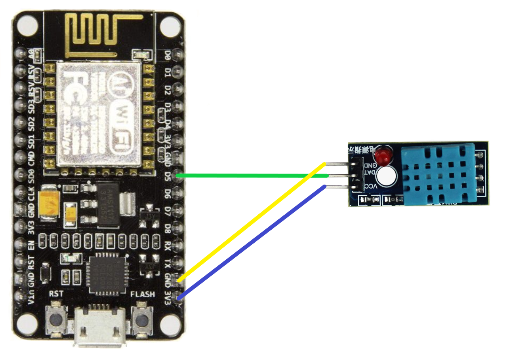

# raspberry-esp8266 

This is a small project to use a combination of ESP8266 and Raspberry Pi to obtain data on humidity and temperature in an apartment and output it to a web server.

Below are instructions for those who want to repeat this project. 
`The project is still under development and will be improved over time. There are plans to add a separate page for managing the task scheduler, as well as more graphics for viewing changes in temperature and humidity over the course of an hour, day, week, month, etc.`

## Connecting the DHT11 sensor to ESP8266



```bash
  DHT11 GND -> ESP8266 GND
  DHT11 DAT -> ESP8266 D5
  DHT11 VCC -> ESP8266 3V3
```

## Deployment

Installing and checking Python and pip version on Raspberry Pi


### 1. Checking the installed version of Python:
```bash
  python3 --version
```

### 2. Installing Python 3.x:
```bash
  sudo apt update
  sudo apt install python3
  sudo apt install python3-pip
```

### 3. Checking pip version:
```bash
  python3 --version
```

===========================================================================================
## Installing PostgreSQL and creating a database

### 1. Install PostgreSQL on Raspberry Pi:
```bash
  sudo apt update
  sudo apt install postgresql postgresql-contrib
```

### 2. Creating a database and user:
```bash
  sudo -u postgres psql
  CREATE USER your_user WITH PASSWORD 'your_password';
  CREATE DATABASE your_database;
  GRANT ALL PRIVILEGES ON DATABASE your_database TO your_user;

  \q
```

===========================================================================================
## Installing Flask and creating a project

### 1. Installing libraries for a Flask application:
```bash
  pip3 install Flask psycopg2-binary
  pip3 install Flask-SQLAlchemy
  pip3 install schedule
  pip3 install pytz
```

### 2. Creating the structure of a Flask application (if you create it manually):
```bash
  mkdir flask_esp8266_app
  cd flask_esp8266_app
  touch app.py
  mkdir templates
  touch templates/index.html
```

### 3. Copy the code from the repository into your created files:
```bash
  nano app.py (copy the code for app.py here);
  nano /templates/index.html (copy the code for index.html here).
```

### 4. Setting:
```bash
  Replace:
* SQLALCHEMY_DATABASE_URI to your psql user, psql password & psql database name;
* Number of sensors;
* Set up the task scheduler or delete/comment it out if you don't need it.
```

### 5. Launching a Flask application:
```bash
  python app.py
```

To check the functionality of the application, launch it and go to the address provided to us by the Flask application and make sure that everything works correctly

### 6. Creating a service file to autostart the application:
```bash
  sudo nano /etc/systemd/system/myflaskapp.service
```

Paste the following text (replace the paths with the correct ones):

```bash
  [Unit]
  Description=ESP8266 Flask App Service
  After=network.target

  [Service]
  ExecStart=/usr/bin/python3 /home/USER/flask_esp8266_app/app.py
  WorkingDirectory=/home/USER/flask_esp8266_app
  Restart=always
  User=vitalijs.zukovs

  [Install]
  WantedBy=multi-user.target
```

### 7. Restart systemd:
```bash
  sudo systemctl daemon-reload
```

### 8. Enable the service:
```bash
  sudo systemctl enable myflaskapp.service
```

### 9. Start the service:
```bash
  sudo systemctl start myflaskapp.service
```

